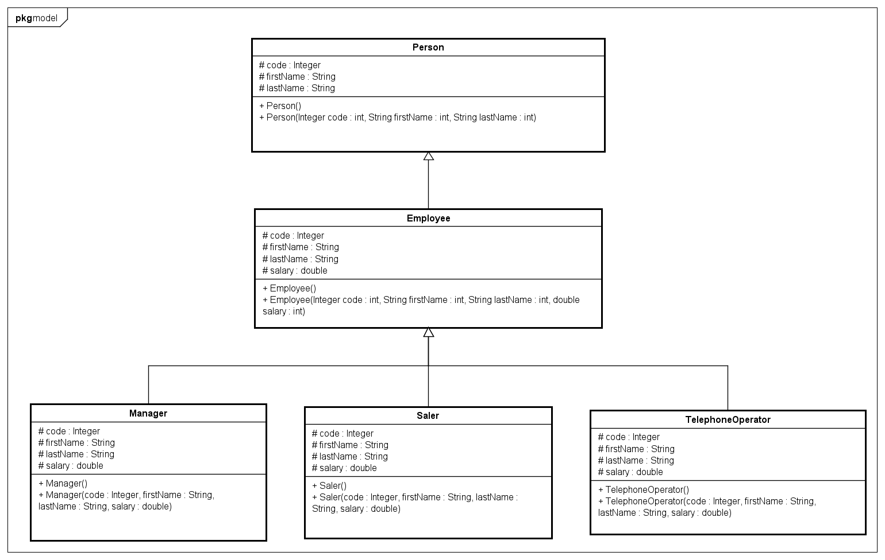
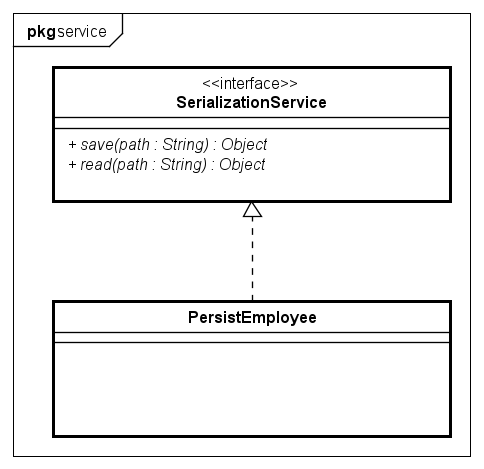

# Projeto: Folha de Pagamento com Padrões de Herança

Este projeto implementa um sistema simples de "Folha de Pagamento" para calcular o salário de funcionários com base em seus cargos, aplicando os princípios de Programação Orientada a Objetos (POO), especialmente a **Herança**.

## 📝 Descrição do Problema (Escopo Organizacional)

A empresa fictícia para a qual este sistema foi desenvolvido possui um padrão de pagamento de salário bem definido:
- Todos os funcionários possuem um **salário líquido base de R$ 2.000,00**.
- Sobre este valor base, é aplicado um acréscimo percentual que varia conforme o cargo:
  - **Gerente:** + 45%
  - **Telefonista:** + 10%
  - **Vendedor:** + 25%

O objetivo do programa é calcular e exibir o salário final para cada um desses cargos de forma estruturada e escalável.

---

## 💡 Análise e Solução Proposta

Para atender aos requisitos de forma eficiente e permitir a fácil adição de novos cargos no futuro, a solução foi modelada utilizando **Herança**.

A análise do diagrama de classes (Figura 1) e do problema nos leva à seguinte estrutura:

1.  **Classe Base (`Funcionario`):** Foi identificada a necessidade de uma classe-mãe que represente um funcionário genérico. Esta classe centraliza os atributos e comportamentos comuns a todos os cargos.
    -   **Atributos Comuns:** Um nome para identificação e o valor do salário base.
    -   **Comportamento Comum:** Um método para calcular o salário, que nas classes filhas terá uma implementação específica.

2.  **Classes Derivadas (`Gerente`, `Telefonista`, `Vendedor`):** Cada cargo específico é representado por uma classe que **herda** da classe `Funcionario`.
    -   Elas reutilizam os atributos da classe-mãe.
    -   Elas **sobrescrevem** o método de cálculo de salário (`calcularSalario()`) para aplicar seu percentual de acréscimo específico. Este é um exemplo prático de **Polimorfismo**.

Essa abordagem torna o sistema limpo, organizado e extensível. Se um novo cargo, como "Analista", for criado, basta criar uma nova classe `Analista` que herda de `Funcionario` e implementar sua própria regra de cálculo, sem a necessidade de alterar as classes já existentes.

---

### 🏛️ Modelo das Classes

O projeto é estruturado em torno de uma classe base e classes derivadas que representam os diferentes cargos.

#### **`Funcionario` (Classe Base)**
Esta classe serve como o "molde" para qualquer funcionário.
-   **Atributos:** Contém as propriedades fundamentais, como o nome do funcionário e o salário base constante de R$ 2.000,00.
-   **Métodos:** Inclui um método padrão para o cálculo de salário, que, neste nível, apenas retorna o valor base.

#### **`Gerente`, `Telefonista` e `Vendedor` (Classes Derivadas)**
Estas classes representam os cargos específicos e herdam todas as características da classe `Funcionario`.
-   Cada uma delas implementa sua própria versão do método `calcularSalario`.
-   A classe `Gerente` aplica a regra de acréscimo de 45%.
-   A classe `Telefonista` aplica a regra de acréscimo de 10%.
-   A classe `Vendedor` aplica a regra de acréscimo de 25%.

#### **`SerializationService` (Interface)**
Essa classe vai ser o "contrato" para qualquer classe que tiver a lógica de persistir dados em memória secundaria em bytecodes.

#### **`PersistenceEmployee` (Classe que implementa a interface/realiza)**

---

## 🚀 Como Executar o Projeto

Para testar a implementação deste projeto, siga os passos gerais abaixo:

1.  **Obtenha o código-fonte** do projeto a partir do repositório.
2.  **Compile os arquivos-fonte** do projeto utilizando um compilador da linguagem escolhida (ex: JDK para Java).
3.  **Execute a classe principal** que contém a lógica de inicialização para instanciar os objetos de cada cargo e exibir os resultados dos cálculos de salário.

=======
## Getting Started

Welcome to the VS Code Java world. Here is a guideline to help you get started to write Java code in Visual Studio Code.

## Folder Structure

The workspace contains two folders by default, where:

- `src`: the folder to maintain sources
- `lib`: the folder to maintain dependencies

Meanwhile, the compiled output files will be generated in the `bin` folder by default.

> If you want to customize the folder structure, open `.vscode/settings.json` and update the related settings there.

## Dependency Management

The `JAVA PROJECTS` view allows you to manage your dependencies. More details can be found [here](https://github.com/microsoft/vscode-java-dependency#manage-dependencies).

Versão do JDK para executar o programa=https://www.oracle.com/br/java/technologies/downloads/#java17-windows

